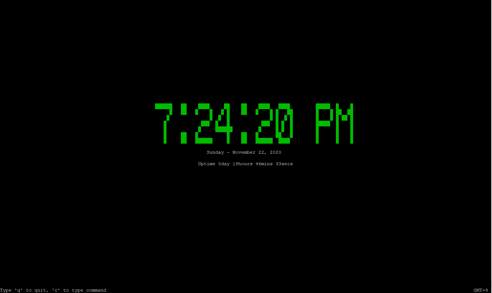

# ncurses-clock

Draws a clock in the terminal window using the ncurses library.
This repo is forked from [mes32](https://github.com/mes32/ncurses-clock)



## Setup

```bash
# Clone this repository
git clone https://github.com/minping/ncurses-clock.git

# Compile the program using the Makefile
cd ncurses-clock

# If you just want to build binary, 
make all

# If you want to install binary to /usr/bin, 
make install

# Start the clock
./bin/clock
clock		#If you installed binary
```

## Makefile

```bash
# Turn DEBUG on to make .core files
make all DEBUG=YES

# Build binary
make all

# Install binary
make install

# Uninstall binary
make uninstall

# Clean temporary files
make clean

# Run binary immediately (for dev)
make run
```

## Usage

There are a few alternate usage mode available.

```
Usage : clock [--auto, -a] [--12h, -t] [--24h, -o] [--secs=on, -s] [--secs=off, -m] [--help, -h]
options supported:
   --auto, -a         Display time with variable formats controlled by console size (default)
                      (Other options are aborted if this option is set from command line)
   --12h, -t          Use 12-hour clock mode
   --24h, -o          Use 24-hour clock mode
   --secs=on, -s      Display time including seconds
   --secs=off, -m     Display time without seconds
   --help, -h         Show this help message
```

## License

The code in this repository is licensed under the [MIT License](./LICENSE).

## Other Information

This repo is tested on [FreeBSD 12.2-RELEASE](https://www.freebsd.org/) with [LLVM/Clang](https://clang.llvm.org/).
